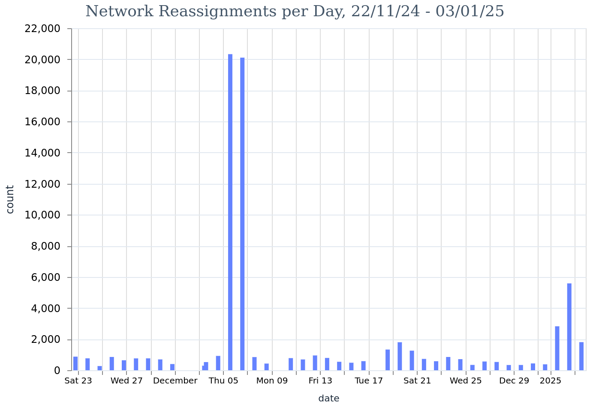

# Daily Diff Data

Running kartograf every day, we can look at changes in ASmap and understand broader changes in AS distribution.

The data was pulled from running a `python3 contrib/asmap/asmap-tool.py diff` with the day and previous day's ASmap files. Thus we get daily snapshots of changes, but also get `nil` values for either the previous or current ASN, if that network is missing from either file.

For simplicity, we just take changes where we have both the incoming and outgoing ASN (see [livebook](./analysis.livemd)).

#### Reassignments per Day
Count of reassignments per day.

#### Reassignment Frequency
Count of networks grouped by count of ASN reassignments.

#### Reassignment Volume by ASN
Highest volume reassignments by ASN.

#### Reassignment by Unique ASN
Count of ASN reassignments, by unique ASNs for that network.
Some high-volume reassignments are just swapping back and forth between 2 ASNs. Could be an error or intentional.

